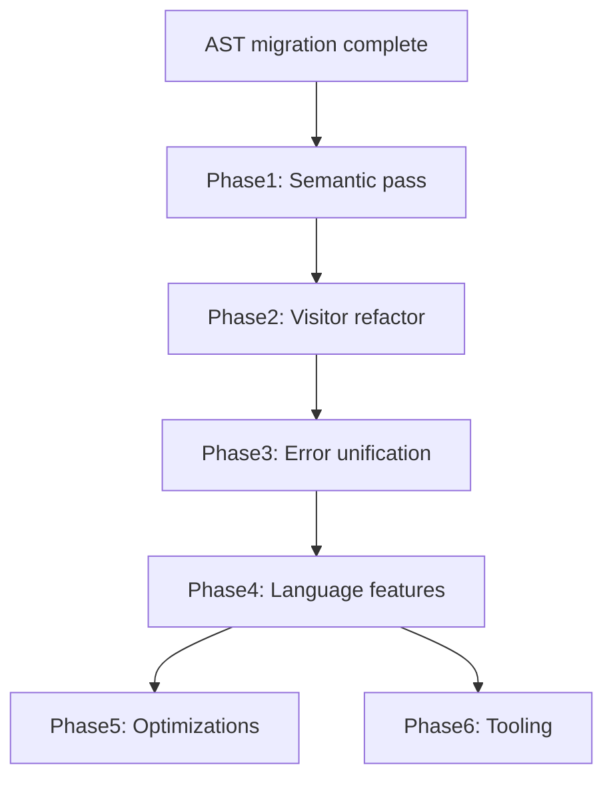

# AST Migration Roadmap

This document tracks completed AST migration work and planned next steps. It is the canonical reference for future compiler/AST evolution.

## Completed (merged to `dev`)

| Milestone | Status | Summary |
|-----------|--------|---------|
| AST types | Done | `src/ast/` — `Expr`, `Stmt`, `Decl`, `Program`, `Span` |
| Parser extraction | Done | `src/parser/` — GC-free Pratt + recursive descent |
| Codegen extraction | Done | `src/codegen/` — AST visitor → bytecode |
| Structured parse errors | Done | `ParseError` with line numbers |
| Legacy direct-to-bytecode removal | Done | Old monolithic `compiler.rs` parser deleted |
| AST dump tooling | Done | `--dump-ast`, tree + JSON, VS Code launch configs |
| Line number fix | Done | Single source of truth in `read_char`; start-line spans |

### Current pipeline

```
Source → Lexer → Parser → Program AST → Codegen → ObjFunction → VM
```

---

## Phase 1 — Semantic analysis pass

**Goal:** Separate name resolution and validation from codegen.

Today codegen in `src/codegen/emit.rs` performs scope resolution inline (`resolve_local`, `declare_local`). A dedicated pass would:

1. Add `src/semantic/` (or `src/ast/resolve.rs`)
2. Walk AST and build symbol tables per scope
3. Emit `SemanticError` for duplicate locals, undefined variables, invalid assignments
4. Annotate AST nodes with resolved bindings (local slot index or global flag)

**Benefits:** Cleaner codegen, better error messages, foundation for closures and modules.

**Files affected:** `src/codegen/emit.rs` (simplify), new `src/semantic/`, `src/parser/error.rs` (move some errors)

---

## Phase 2 — Visitor infrastructure

**Goal:** Use the existing `Visitor` trait for multiple AST passes.

`src/ast/visit.rs` defines a trait but nothing implements it yet. Planned visitors:

| Visitor | Purpose |
|---------|---------|
| `Resolver` | Phase 1 symbol resolution |
| `Codegen` | Refactor `emit.rs` to implement `Visitor` |
| `PrettyPrinter` | Refactor `pretty.rs` tree output |
| `Linter` | Unused variables, unreachable code (future) |

**Action:** Add default traversal helpers (`walk_expr`, `walk_stmt`) to reduce boilerplate.

---

## Phase 3 — Compile-time error unification

**Goal:** Consistent error type and reporting across parse, semantic, and codegen phases.

```rust
pub enum CompileError {
    Parse(ParseError),
    Semantic(SemanticError),
    Codegen(CodegenError),
}
```

- Replace remaining `panic!` in codegen (`emit.rs`) with `CompileError`
- User-facing formatter: `[line N] message` for REPL and CLI
- REPL: print compile errors without `Debug` formatting

**Files affected:** `src/compiler.rs`, `src/repl.rs`, `src/source.rs`, `src/vm.rs`

---

## Phase 4 — AST extensions for new language features

When adding features, extend AST first, then parser, then codegen. Planned node additions:

| Feature | AST changes | Notes |
|---------|-------------|-------|
| Native functions | `Expr::NativeCall` or builtin ident table | `ObjNativeFunction` stub exists |
| Classes | `Decl::Class`, `Expr::MethodCall`, `Expr::GetProperty` | `ObjectType::CLASS` reserved |
| Closures | `Expr::Closure`, upvalue capture in resolver | Requires Phase 1 |
| Modules / imports | `Decl::Import`, `Program` multi-unit | Top-level `Program` may become `Module` |
| Arrays / indexing | `Expr::Index`, `Expr::ArrayLiteral` | New `Value` variant needed |
| `OP_MOD` | `BinaryOp::Mod` already in AST | Wire codegen + VM (VM opcode exists) |

Use `#[non_exhaustive]` on public AST enums once the API stabilizes.

---

## Phase 5 — Optimization passes (optional)

Low priority until language surface stabilizes:

1. **Constant folding** — evaluate literal arithmetic at compile time
2. **Dead code elimination** — remove unreachable statements after `return`
3. **Dedicated comparison opcodes** — replace `GEQ`/`LEQ`/`NEQ` opcode pairs

These operate on AST or a linearized IR derived from AST.

---

## Phase 6 — Tooling and developer experience

| Item | Description |
|------|-------------|
| `lockhart --dump-bytecode` | Disassemble compiled chunk alongside AST dump |
| AST JSON schema | Document JSON dump format for external visualizers |
| Source maps | Map bytecode offsets back to `Span` for runtime errors |
| LSP / highlighting | Spans enable jump-to-definition and diagnostics later |

---

## Dependency graph



Phases 1–3 are prerequisites for most Phase 4 features. Phases 5–6 can proceed in parallel once Phase 3 is complete.

---

## Guidelines for contributors

1. **Never emit bytecode from the parser** — parser output is always `Program`.
2. **Never allocate on the GC heap during parsing** — intern strings in codegen only.
3. **Every new syntax needs:** AST node → parser rule → codegen arm → test in `parser/tests.rs` and `vm/tests.rs`.
4. **Spans:** capture start line at construct begin; use `span_since(start, line)` pattern from `parser/mod.rs`.
5. **Docs:** update [ast.md](./ast.md) and this file when adding phases or completing milestones.